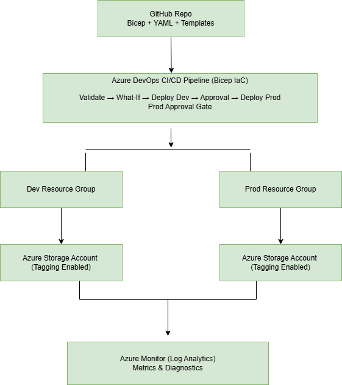
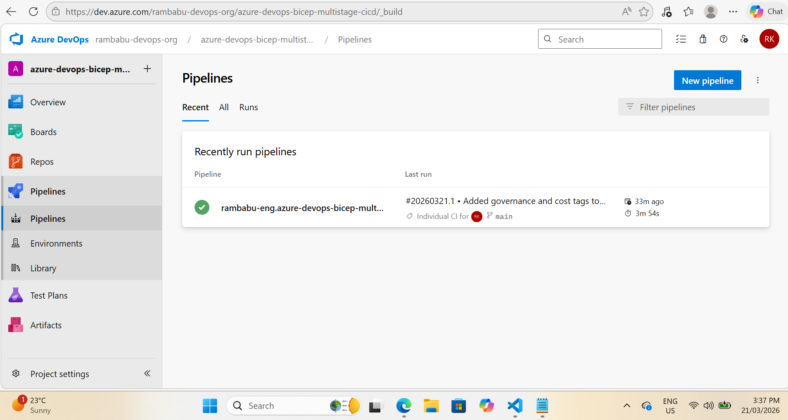
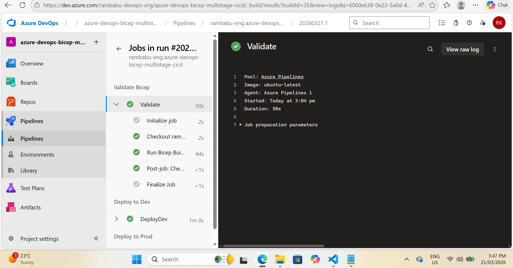
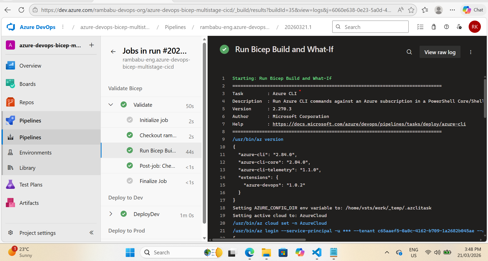
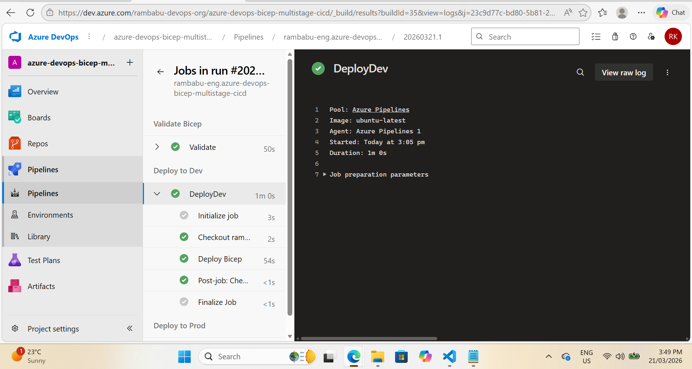
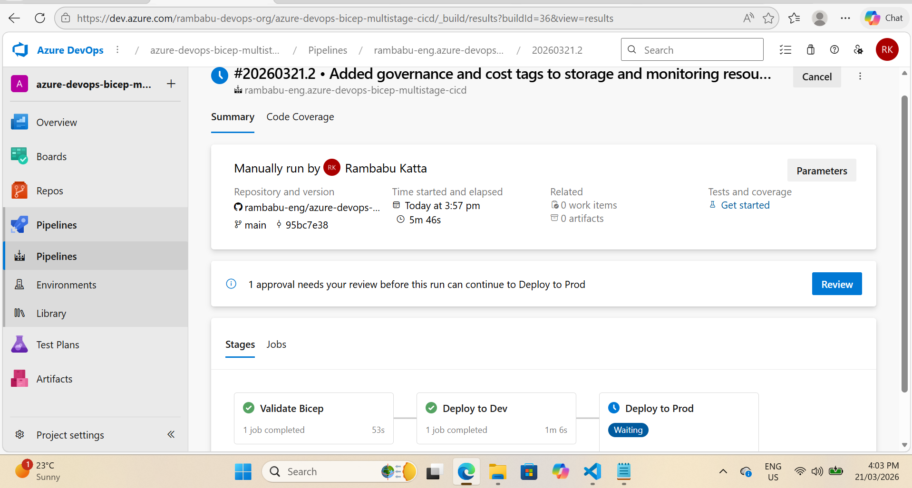
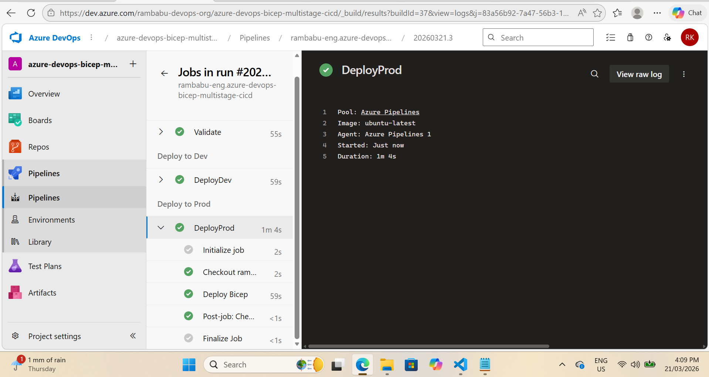
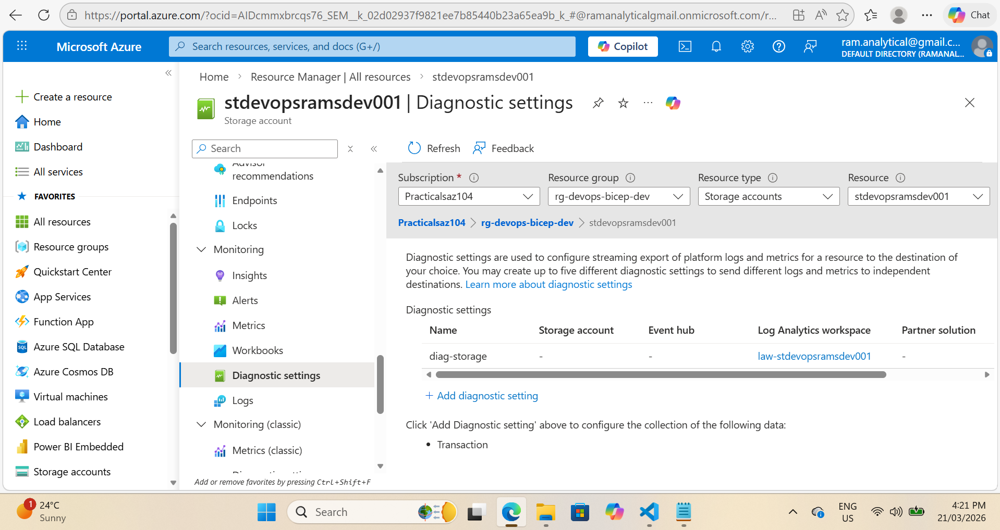
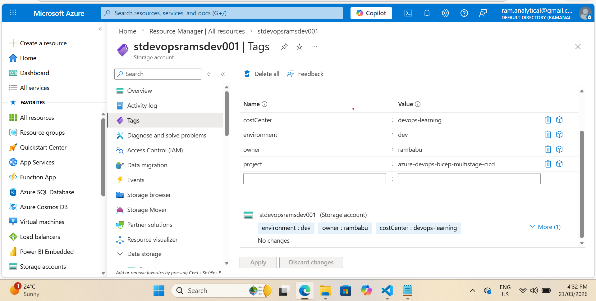

# Azure DevOps Bicep Multi-Stage CI/CD Pipeline

A multi-stage Azure DevOps pipeline for deploying Azure infrastructure using **Bicep Infrastructure as Code**.

The solution demonstrates infrastructure validation, What-If change preview, automated Development deployment, approval-controlled Production release, reusable YAML templates, monitoring, and resource governance.

## Architecture



```text
Developer
   │
   ▼
Azure Repos
   │
   ▼
Azure DevOps Pipeline
   │
   ├── Validate Bicep
   ├── Run What-If
   ├── Deploy to Development
   ├── Production Approval
   └── Deploy to Production
                  │
                  ▼
           Azure Resources
                  │
          ┌───────┴────────┐
          ▼                ▼
     Log Analytics     Resource Tags
```

## Pipeline Flow

```text
Code
→ Validate
→ What-If
→ Deploy Development
→ Production Approval
→ Deploy Production
```

### Pipeline Stages

1. **Validate**
   Builds and validates the Bicep templates before deployment.

2. **What-If**
   Previews planned Azure resource changes.

3. **Deploy Development**
   Automatically deploys infrastructure to the Development environment.

4. **Production Approval**
   Requires manual approval before the Production deployment proceeds.

5. **Deploy Production**
   Deploys the approved infrastructure configuration to Production.

## Design Principles

The solution applies Azure DevOps and infrastructure delivery practices through:

* **Infrastructure as Code:** Azure resources are defined using reusable Bicep modules.
* **Controlled change:** What-If provides visibility into infrastructure changes before deployment.
* **Environment separation:** Development and Production use separate deployment stages and configuration.
* **Release governance:** Production deployment requires manual approval.
* **Operational visibility:** Diagnostic settings send platform logs to Log Analytics.
* **Resource governance:** Standard resource tags support ownership, environment identification, and cost visibility.
* **Pipeline reuse:** YAML templates reduce duplication across stages and environments.

## Technology Stack

| Area                   | Technology                          |
| ---------------------- | ----------------------------------- |
| Cloud platform         | Microsoft Azure                     |
| CI/CD                  | Azure DevOps Pipelines              |
| Infrastructure as Code | Bicep                               |
| Pipeline definition    | YAML                                |
| Deployment tooling     | Azure CLI                           |
| Configuration          | Variable Groups and parameter files |
| Monitoring             | Azure Monitor and Log Analytics     |
| Governance             | Resource tagging                    |
| Environments           | Development and Production          |

## Repository Structure

```text
.
├── bicep/
│   ├── main.bicep
│   ├── modules/
│   └── parameters/
├── pipelines/
│   └── templates/
├── azure-pipelines.yml
└── docs/
    ├── architecture/
    └── screenshots/
```

> Update this structure to match the exact folders used in the repository.

## Pipeline Configuration

The pipeline uses:

* Reusable YAML templates
* Environment-specific parameter files
* Azure DevOps Variable Groups
* Azure service connection authentication
* Development and Production environments
* Production approval checks

## Monitoring and Governance

Azure resources are configured with:

* Diagnostic settings
* Centralised Log Analytics collection
* Environment and ownership tags
* Resource-level operational visibility

Example governance tags:

```text
Environment = Development | Production
ManagedBy   = Bicep
Project     = Azure-DevOps-Bicep-Pipeline
Owner       = Platform-Team
```

## Project Evidence

### Pipeline Execution



### Validation and What-If





### Development Deployment



### Production Approval



### Production Deployment



### Monitoring and Governance





## Key Outcomes

* Built a multi-stage infrastructure deployment pipeline using Azure DevOps and Bicep.
* Added Bicep validation and What-If previews before deployment.
* Automated Development infrastructure deployment.
* Implemented approval-controlled Production releases.
* Created reusable YAML pipeline templates.
* Centralised diagnostic data in Log Analytics.
* Applied resource tagging for governance and cost visibility.

## Roadmap

* Azure Policy for enforcing tagging and configuration standards
* Azure budget alerts and cost monitoring
* Workload identity or federated authentication for pipeline access
* Automated post-deployment validation
* Bicep linting and security scanning
* Deployment rollback and failure-handling procedures
* Additional environments such as Test or Staging

## Author

**Rambabu Katta**
Azure Cloud, DevOps and Platform Engineering
